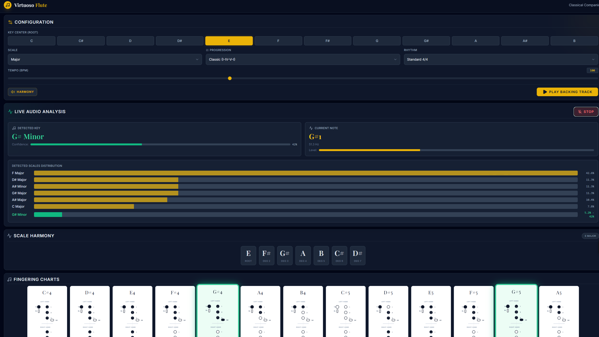

# Virtuoso Flute Companion

An interactive practice companion for flutists. Configure keys and scales, play backing tracks, analyze live audio from your microphone, and see matching fingering charts and harmonic context.

Built with **React** and **Vite**.

---

## Features

- **Configuration panel**
  - Choose key center (root), scale type, chord progression, rhythm, and tempo.
  - Toggle harmony (chords) on/off while the backing track plays.

- **Backing track generator**
  - Plays looped progressions in the selected key/rhythm.
  - UI highlights the currently sounding scale degrees.

- **Live audio analysis**
  - Uses the Web Audio API to analyze microphone input in real time.
  - Detects the **current note** (with frequency) and **musical key** using a chroma‑based key‑finding algorithm.
  - Tracks a **Detected Scales Distribution** histogram over time and shows confidence for the current key.

- **Scale harmony view**
  - Displays the degrees of the current scale (Root, Deg 2–7).
  - Highlights notes that are active in the backing track or detected from live audio.

- **Flute fingering charts**
  - Shows Boehm flute fingerings for scale notes in two octaves.
  - Highlights fingerings corresponding to selected or detected notes.
  - Includes curated alternate fingerings (Bb options, forked F, etc.).

---

## Getting Started

### Prerequisites

- **Node.js** (LTS recommended)

If you are new to code or terminals, follow these steps slowly:

1. Install Node.js from https://nodejs.org (download the **LTS** version and run the installer).
2. Download or clone this project to your computer.
3. Open the project folder `VirtaoseFlute` in VS Code (or your editor of choice).
4. Open a terminal **inside the project folder**:
   - In VS Code: `Terminal` → `New Terminal` (it should show the project path, e.g. `.../VirtaoseFlute`).

### Installation (one-time setup)

In that terminal, install the dependencies:

```bash
npm install
```

Wait until it finishes without errors before continuing.

### Run the app locally

Start the development server:

```bash
npm run dev
```

You will see a local URL in the terminal (typically `http://localhost:5173`).
Copy that URL and paste it into your browser’s address bar to open the app.

> Note: The current codebase does **not** require a Gemini API key to run. Any older references to `GEMINI_API_KEY` can be ignored unless you add AI features that use it.

---

## Screenshot




## Using the App

1. **Configure** the key, scale, progression, rhythm, and tempo in the top section.
2. Click **Play Backing Track** to start the generated harmony.
3. Click **Start Listening** in the *Live Audio Analysis* section and allow microphone access.
4. Play your flute:
   - The **Detected Key** and **Current Note** cards update in real time.
   - The **Detected Scales Distribution** histogram accumulates detected keys and reflects confidence.
   - The **Scale Harmony** badges and **Fingering Charts** highlight notes that match what you play.


## Tech Stack

- React 19
- Vite 6
- TypeScript 5
- lucide-react (icons)
